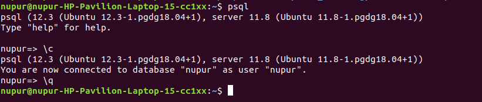
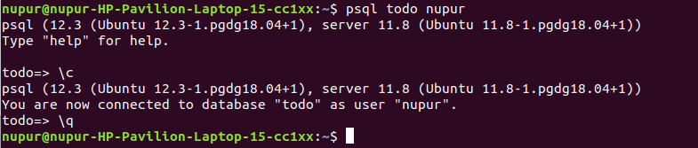

# PostgreSQL
Learning Repository.
<h1>For Ubuntu machine</h1>
<h2> Connect to Postgres using psql </h2>

`psql` #will connect to the dafault user and database present in postgres.

<div>
	
</div>

`psql todo nupur` #todo <dbname> <username> to connect to a specific user and data base.
	
<div>
	
</div>

<h2> Few Handy Commands </h2>

`\c` - To get the connection details.

`\q` - To quit psql.

`\l` - To list all the databases.

`\d` - To get all the relations in a specific databases.

`\d Account` - To descibe the relation Account

<h2> CREATE Database </h2>

`CREATE DATABASE Todo` #It creates a datbase named Todo

<h2> CREATE Table </h2>
```
create table Account(
ID serial PRIMARY KEY,
Name varchar(50) NOT NULL,
Email varchar(50) UNIQUE NOT NULL,
Username varchar(50) UNIQUE NOT NULL,
Password varchar(50),
createdOn TIMESTAMP NOT NULL,
lastLogin TIMESTAMP NOT NULL,
isDeleted BOOLEAN DEFAULT false
);
```
